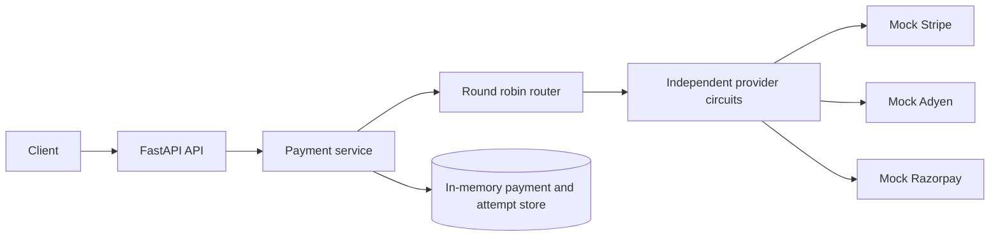
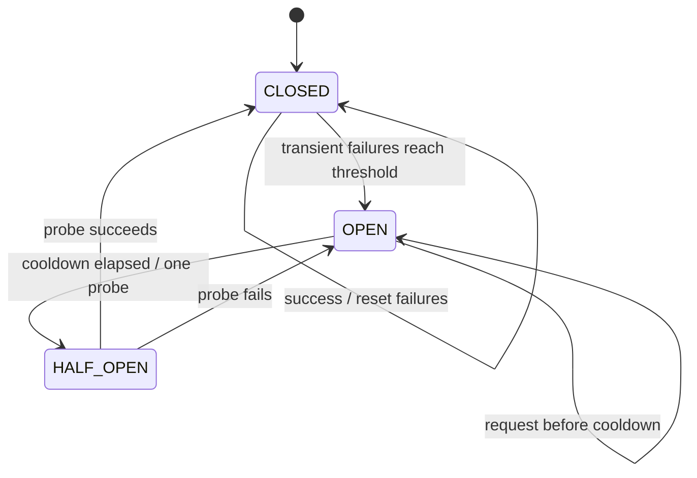

# PySwitch

PySwitch is a locally runnable payment orchestration demonstrator. It exposes one provider-neutral FastAPI API and uses deterministic Stripe, Adyen and Razorpay test doubles. It never accepts raw card data or charges real money.

## Run

```bash
python -m venv .venv
. .venv/bin/activate
pip install -e '.[dev]'
uvicorn pyswitch.main:app --reload
```

Run the fast slice tests with `pytest`. Create a payment:

```bash
curl -X POST http://127.0.0.1:8000/api/v1/payments \
  -H 'Content-Type: application/json' -H 'Idempotency-Key: demo-1' \
  -d '{"merchant_id":"merchant_123","amount":500000,"currency":"INR","payment_method":{"type":"card","token":"test_card"}}'
```

`POST /api/v1/payments`, `GET /api/v1/payments/{id}`, `GET /api/v1/payments`, `GET /api/v1/providers`, `GET /api/v1/providers/{provider}`, `/health`, and `/ready` are included in this first vertical slice. Provider selection is round robin among healthy providers. Provider choice stays in internal attempt history and is not returned by the payment API.

The reliability slice retries transient provider-unavailable and 502/503 errors with bounded exponential backoff and jitter. Each provider has an independent `CLOSED -> OPEN -> HALF_OPEN` circuit. Failover is allowed for unavailable providers after retries; an ambiguous timeout stays on the original provider and is never blindly charged on a second provider.





Local failure demonstrations use `X-Admin-Token: local-dev-only` (change `PYSWITCH_ADMIN_TOKEN` outside local demos):

```bash
curl -X POST http://127.0.0.1:8000/api/v1/admin/providers/mockstripe/fail -H 'X-Admin-Token: local-dev-only'
curl -X POST http://127.0.0.1:8000/api/v1/admin/providers/mockstripe/recover -H 'X-Admin-Token: local-dev-only'
curl -X PUT http://127.0.0.1:8000/api/v1/admin/providers/mockstripe/config \
  -H 'X-Admin-Token: local-dev-only' -H 'Content-Type: application/json' \
  -d '{"min_latency_ms":25,"max_latency_ms":50}'
```

The current slice uses an in-memory store so it is easy to run in a clean checkout. PostgreSQL/SQLAlchemy, Redis-backed idempotency, refunds, events, metrics, and Compose remain later milestones. See [`docs/adr/0001-reliability-policy.md`](docs/adr/0001-reliability-policy.md) and [`docs/runbook.md`](docs/runbook.md) for the simulated failure procedure.

Further design references:

- [`docs/architecture.md`](docs/architecture.md) — component boundaries, data flow, payment sequence, and simulated outage timeline.
- [`docs/state-machines.md`](docs/state-machines.md) — payment, retry, circuit, and idempotency state machines.
- [`docs/adr/0002-provider-neutral-orchestration.md`](docs/adr/0002-provider-neutral-orchestration.md) — provider-neutral orchestration and routing decision.
