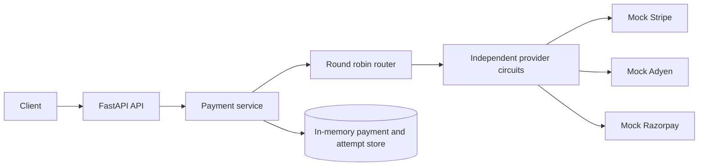
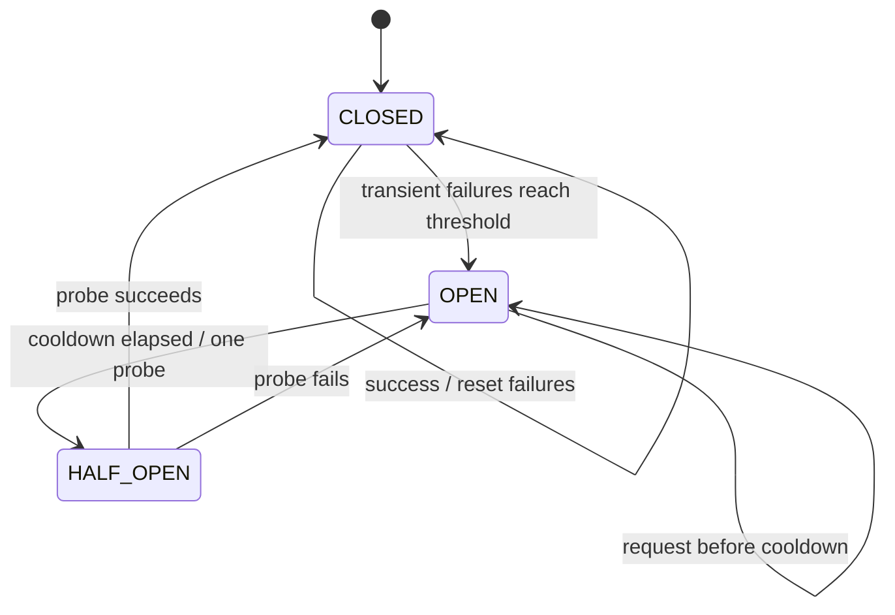

# PySwitch

PySwitch is a locally runnable payment orchestration demonstrator. It exposes one provider-neutral FastAPI API and uses deterministic Stripe, Adyen and Razorpay test doubles. It never accepts raw card data or charges real money.

## Run

```bash
python -m venv .venv
. .venv/bin/activate
pip install -e '.[dev]'
uvicorn pyswitch.main:app --reload
```

Run the fast slice tests with `pytest`. Create a payment:

```bash
curl -X POST http://127.0.0.1:8000/api/v1/payments \
  -H 'Content-Type: application/json' -H 'Idempotency-Key: demo-1' \
  -d '{"merchant_id":"merchant_123","amount":500000,"currency":"INR","payment_method":{"type":"card","token":"test_card"}}'
```

The local full-stack configuration is:

```bash
docker compose up --build
```

It exposes the API on `8000`, Prometheus on `9090`, Grafana on `3000` (`admin/admin`), PostgreSQL on `5432`, Redis on `6379`, and Redpanda's external Kafka port on `19092`. Container healthchecks gate startup order. `/metrics` is available on the API.

Runtime dependencies are selected explicitly with `PYSWITCH_STORAGE_BACKEND=memory|postgres`, `PYSWITCH_COORDINATION_BACKEND=memory|redis`, and `PYSWITCH_EVENT_BACKEND=memory|kafka`. Connection variables are `PYSWITCH_DATABASE_URL`, `PYSWITCH_REDIS_URL`, `PYSWITCH_KAFKA_BOOTSTRAP_SERVERS`, and `PYSWITCH_KAFKA_TOPIC`; their defaults target the local Compose service names. The default values keep the app process-local. See [`docs/runtime-profiles.md`](docs/runtime-profiles.md) for the complete contract and optional dependency commands.

Provider calls are unlimited by default for compatibility. Set `PYSWITCH_PROVIDER_CONCURRENCY_LIMIT` to a positive value for a process-wide limit on every provider, or set `max_concurrency` through `PUT /api/v1/admin/providers/{provider}/config` for one provider (`0` disables that provider's limit). The app lifespan starts a bounded-retry outbox worker and stops it before runtime resources close. The worker proves local retry/recovery behavior; it does not claim durable Kafka delivery or cross-process worker coordination.

Optional load and live dependency entrypoints are documented in [`docs/load-testing.md`](docs/load-testing.md). `pip install -e '.[load]' && locust -f locustfile.py --host http://127.0.0.1:8000` runs the synthetic scenario; `PYSWITCH_RUN_INTEGRATION=1 pytest -q tests/integration` probes PostgreSQL, Redis, and Kafka/Redpanda and skips unavailable services. No benchmark or reachability result is implied until a run records it.

`POST /api/v1/payments`, `GET /api/v1/payments/{id}`, `GET /api/v1/payments` with merchant/status/time filters, `POST /api/v1/payments/{id}/refund`, `GET /api/v1/providers`, `GET /api/v1/providers/{provider}`, `/health`, and `/ready` are included in this first vertical slice. Readiness reports provider and selected runtime dependency status and returns 503 when one is unavailable. Provider selection defaults to round robin among healthy providers and can use `round_robin`, `weighted_round_robin`, `lowest_latency`, `highest_success_rate`, or `composite`; configure it with `PYSWITCH_ROUTING_STRATEGY` or `PUT /api/v1/admin/routing-strategy`. Provider choice stays in internal attempt history and is not returned by the payment API. Routing measurements are bounded, process-local mock observations in this build.

The reliability slice retries transient provider-unavailable and 502/503 errors with bounded exponential backoff and jitter. Each provider has an independent `CLOSED -> OPEN -> HALF_OPEN` circuit. Failover is allowed for unavailable providers after retries; an ambiguous timeout stays on the original provider and is never blindly charged on a second provider.

Provider status and `/metrics` expose cumulative request outcomes, timeout
counts, bounded-window average/p95 latency, in-flight calls, and last success or
failure timestamps. These are process-local observations; they are not shared
health history or production performance measurements. See
[`docs/adr/0009-operational-health-evidence.md`](docs/adr/0009-operational-health-evidence.md).





Local failure demonstrations use `X-Admin-Token: local-dev-only` (change `PYSWITCH_ADMIN_TOKEN` outside local demos):

```bash
curl -X POST http://127.0.0.1:8000/api/v1/admin/providers/mockstripe/fail -H 'X-Admin-Token: local-dev-only'
curl -X POST http://127.0.0.1:8000/api/v1/admin/providers/mockstripe/recover -H 'X-Admin-Token: local-dev-only'
curl -X PUT http://127.0.0.1:8000/api/v1/admin/providers/mockstripe/config \
  -H 'X-Admin-Token: local-dev-only' -H 'Content-Type: application/json' \
  -d '{"min_latency_ms":25,"max_latency_ms":50}'
```

The default profile uses an in-memory store so it is easy to run in a clean checkout. Fingerprint conflict detection returns `DUPLICATE_REQUEST` when a merchant reuses a key with different payment data. Full and partial refunds are serialized per payment within one process. Selecting `PYSWITCH_STORAGE_BACKEND=postgres` constructs the optional SQLAlchemy repository; selecting `PYSWITCH_COORDINATION_BACKEND=redis` constructs Redis idempotency and rate-limit clients. Install the matching extras first. Migrations, live database/Redis behavior, durable outbox delivery, and external failure evidence remain unverified. See [`docs/adr/0001-reliability-policy.md`](docs/adr/0001-reliability-policy.md) and [`docs/runbook.md`](docs/runbook.md) for the simulated provider failure procedure.

Versioned payment/refund events, an in-memory transactional outbox seam, an in-memory broker, and idempotent consumer contracts are now implemented for local testing. The optional Kafka-compatible adapter is available behind `pip install -e '.[events]'`; Compose provisions Redpanda, while PostgreSQL outbox wiring, live broker workers, durable delivery, and external consumer effects remain deferred.

Further design references:

- [`docs/architecture.md`](docs/architecture.md) — component boundaries, data flow, payment sequence, and simulated outage timeline.
- [`docs/state-machines.md`](docs/state-machines.md) — payment, retry, circuit, and idempotency state machines.
- [`docs/adr/0002-provider-neutral-orchestration.md`](docs/adr/0002-provider-neutral-orchestration.md) — provider-neutral orchestration and routing decision.
- [`docs/adr/0003-data-layer-idempotency-and-refunds.md`](docs/adr/0003-data-layer-idempotency-and-refunds.md) — repository seam, fingerprint conflicts, refunds, and deferred external services.
- [`docs/redis-controls.md`](docs/redis-controls.md) — Redis idempotency/rate-limit flow diagrams and verified implementation notes.
- [`docs/redis-runbook.md`](docs/redis-runbook.md) — labeled simulated Redis outage and recovery procedure.
- [`docs/adr/0004-redis-coordination-and-rate-limits.md`](docs/adr/0004-redis-coordination-and-rate-limits.md) — Redis atomic coordination and fail-closed decision.
- [`docs/eventing.md`](docs/eventing.md) — versioned event contract, outbox sequence, replay behavior, and simulated broker outage runbook.
- [`docs/adr/0005-versioned-events-and-outbox.md`](docs/adr/0005-versioned-events-and-outbox.md) — event/outbox/consumer design decision.
- [`docs/observability.md`](docs/observability.md) — bounded metrics, JSON logs, dashboard scope, and stack boundaries.
- [`docs/operations-runbook.md`](docs/operations-runbook.md) — exact local operations commands and labeled simulated scenarios.
- [`docs/adr/0006-observability-and-local-operations.md`](docs/adr/0006-observability-and-local-operations.md) — observability and Compose decision.
- [`docs/runtime-profiles.md`](docs/runtime-profiles.md) — environment-selected dependency profiles and integration limits.
- [`docs/adr/0007-explicit-runtime-profiles.md`](docs/adr/0007-explicit-runtime-profiles.md) — explicit runtime composition decision.
- [`docs/adr/0008-adaptive-routing-strategies.md`](docs/adr/0008-adaptive-routing-strategies.md) — routing strategies, scoring, and local measurement limits.
- [`docs/adr/0009-operational-health-evidence.md`](docs/adr/0009-operational-health-evidence.md) — circuit transition evidence, readiness, and list filters.
- [`docs/load-testing.md`](docs/load-testing.md) — optional Locust scenario and opt-in live dependency smoke checks.

Known environment limits: the default app still uses in-memory payment storage, Redis seams, and broker; Compose provisions PostgreSQL, Redis, and Redpanda but does not wire their clients into the running service. Grafana and Prometheus files are configuration, not collected performance evidence. No load-test, delivery, latency, or recovery numbers are claimed.
