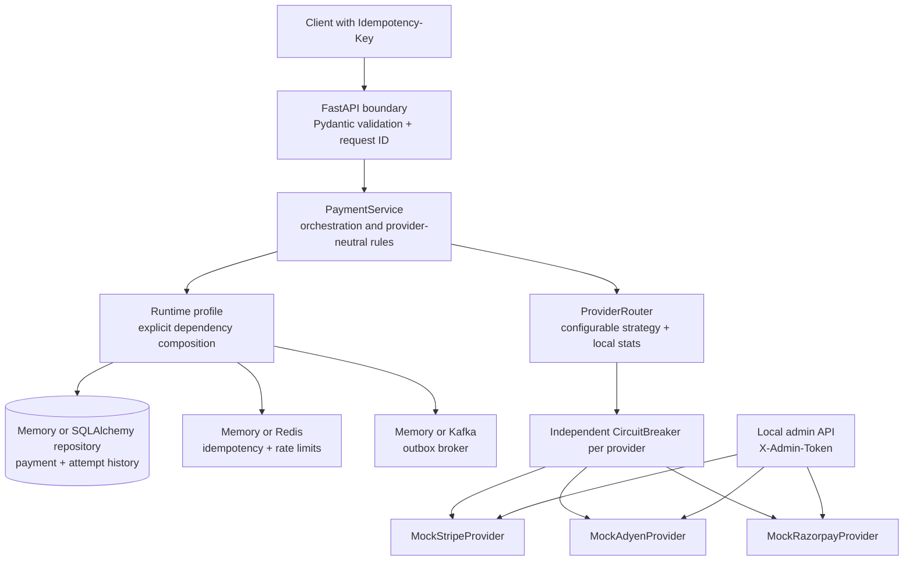
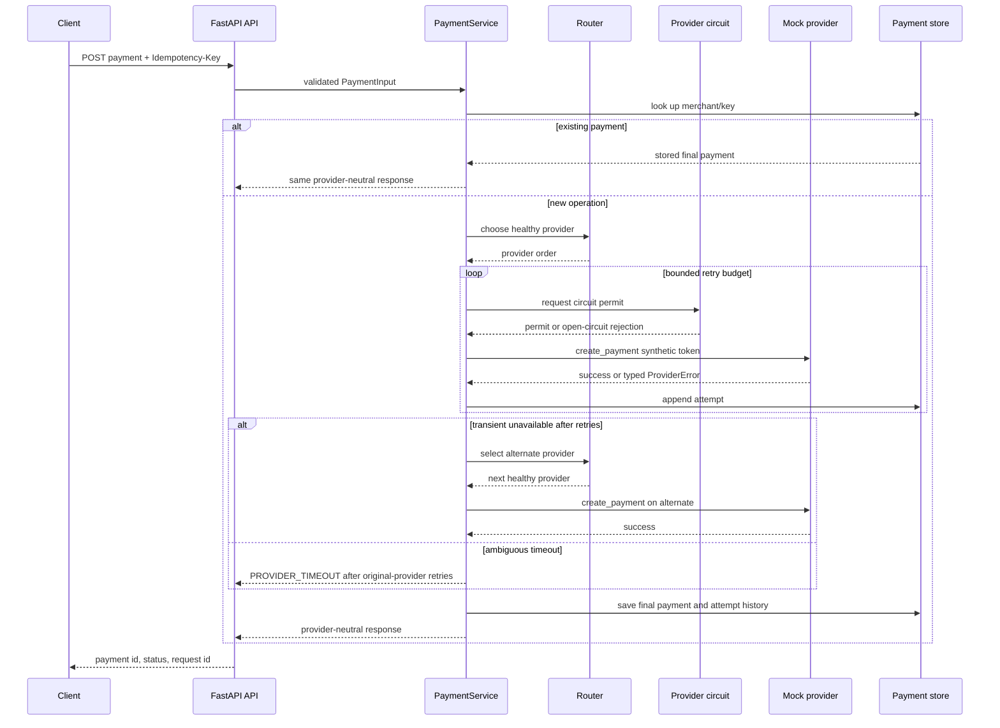
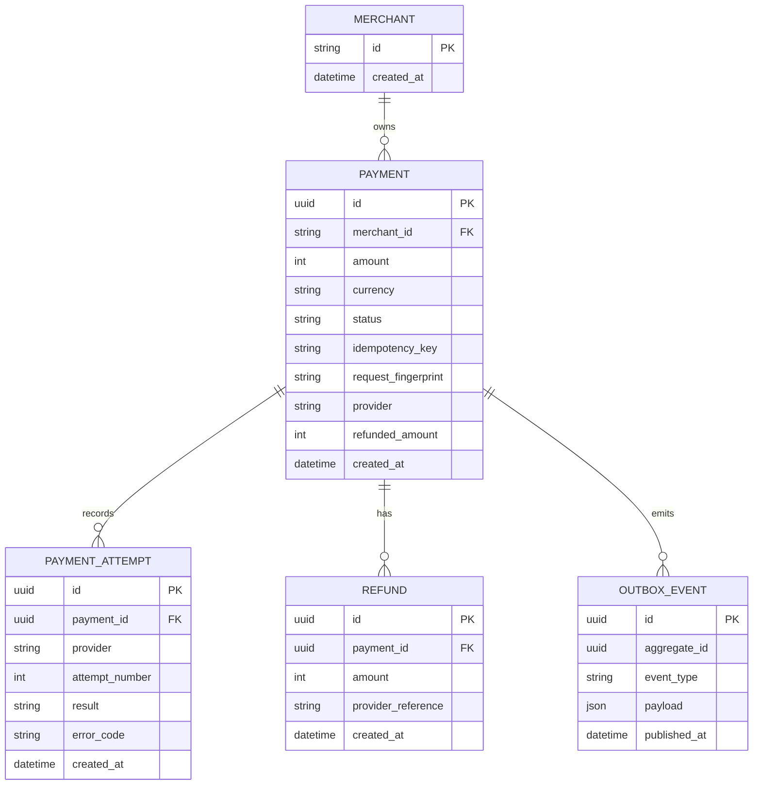
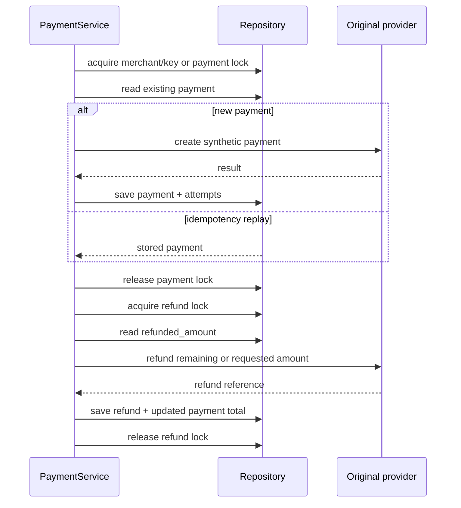

# PySwitch architecture

PySwitch keeps the public contract provider-neutral. The API validates a synthetic payment request, the service selects a provider, and the provider adapter is the only layer that knows how a simulated provider behaves.

## Components and boundaries



The boundary owns HTTP concerns and maps expected domain errors to the common error envelope. `PaymentService` owns idempotency locking, provider ordering, retry policy, failover policy, and payment state. `ProviderRouter` uses only provider names, health-filtered candidates, and bounded request observations; it does not inspect provider-specific behavior. `CircuitBreaker` instances are keyed by provider name, so an outage in one adapter does not open another adapter's circuit. The three adapters implement the same asynchronous protocol and return provider-neutral results to the service.

Routing records a bounded recent window per provider: request success, request
latency, and current in-flight count. Weighted round robin uses
`max(0.05, recent_success_rate)` as its weight. Lowest latency minimizes
`average_latency_ms`, highest success rate maximizes the recent success rate,
and composite maximizes:

```text
success_rate^success_weight
  / (1 + average_latency_ms / 1000)^latency_weight
  / (1 + inflight)^load_weight
  / (1 + recent_failure_rate)^recent_failure_weight
```

The defaults are `(success_weight, latency_weight, load_weight,
recent_failure_weight) = (1, 1, 1, 0)`, which preserve the original score.
Weights are bounded to 0 through 5 and can be selected through environment
settings or the authenticated routing admin endpoint.

Empty candidate sets still raise `No healthy payment provider is available`.
These observations are process-local and come from the mock providers in the
default build; they are not production telemetry or a load-balancing result.

The default profile is intentionally process-local. `build_runtime(Settings)`
can select the SQLAlchemy repository, Redis coordinators, and Kafka broker
explicitly through environment variables; it never silently falls back to
memory after an external profile is selected. The optional adapters are
constructed without network calls, while migrations, row-lock behavior,
cross-process coordination, and live broker delivery still require an
integration environment.

## Payment data flow



Provider names and tokens stay out of the client payment response. Attempt history is retained internally so a later durable repository can expose audit evidence without changing the public payment contract.

## Data model

The optional SQLAlchemy model and Alembic revision mirror this shape. The running default still uses the equivalent Python dataclasses in the in-memory repository.



## Payment and refund transaction boundaries



The repository protocol is the seam for the memory and SQLAlchemy
implementations. The SQLAlchemy adapter writes payment and outbox rows in one
session transaction; live migration, database row-lock, and cross-process
behavior remain integration checks. Redis claims and Kafka publication are
explicit runtime profiles, while durable worker delivery is still deferred.

## Simulated outage timeline

This is a reproducible local simulation from `docs/runbook.md`, not a production incident:

| Point | Simulated action | Expected evidence |
| --- | --- | --- |
| T0 | Set Stripe `server_error_probability` to `1` through the local admin API. | Stripe remains health-checkable but every payment call returns `PROVIDER_UNAVAILABLE`. |
| T1 | Create a payment with a fresh idempotency key. | Stripe receives bounded retries; each attempted call is recorded. |
| T2 | Stripe reaches the configured consecutive-failure threshold. | Only Stripe's circuit changes to `OPEN`. |
| T3 | Retry budget is exhausted. | The service tries Adyen and can return a successful provider-neutral payment. |
| T4 | Read `/api/v1/providers`. | Stripe reports its circuit state; other providers remain independent. |
| T5 | Recover Stripe and restore its config. | The admin recovery resets the local circuit and future routing can include Stripe. |

## Actual-observed implementation notes

These notes describe behavior verified in the implementation and automated tests. They are not claims about a production outage, external latency, or benchmark performance.

- `tests/test_reliability.py::test_service_retries_transient_failure_then_fails_over_with_history` verifies transient failure retries, alternate-provider success, and recorded provider order.
- `tests/test_reliability.py::test_timeout_retries_without_blind_cross_provider_charge` verifies that an ambiguous timeout does not invoke the alternate provider.
- The current implementation uses an in-memory store and in-process locks, which is visible in `store.py` and `service.py`; process restart loses payment history.
- `pytest -q` and `compileall` are the release checks for this local slice; no production incident or load benchmark is represented here.
