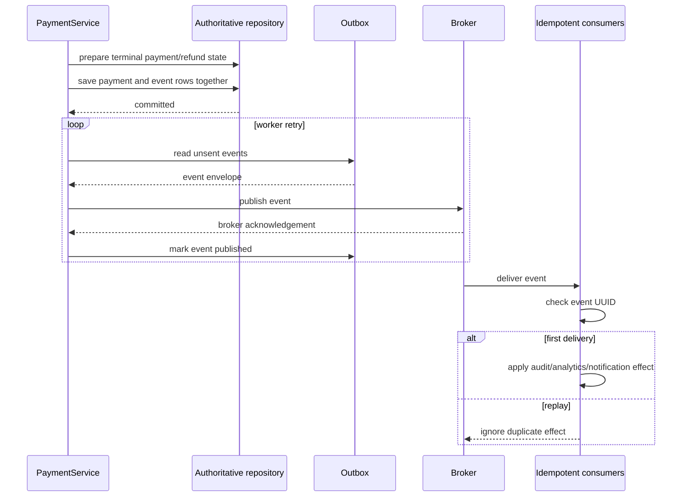

# PySwitch events and outbox

Payment and refund transitions produce typed `EventEnvelope` records. Each envelope has a UUID, event type, merchant ID, optional aggregate/payment ID, optional provider, UTC timestamp, version, and payload. The current version is `1`.

## Transactional outbox flow

The default `InMemoryPaymentStore` implements the repository and outbox seam under one async lock. The explicit PostgreSQL runtime profile uses the SQLAlchemy repository, which writes payment and outbox rows in one session transaction. Neither path is presented as live durability evidence until migrations and a real database run are verified.

## Event contract

| Event | Emitted when | Aggregate |
| --- | --- | --- |
| `payment.created` | New payment enters orchestration | payment ID |
| `payment.processing` | Provider orchestration begins | payment ID |
| `payment.succeeded` | Provider success is saved | payment ID |
| `payment.failed` | Non-retryable/exhausted result is saved | payment ID |
| `payment.refunded` | Full or partial refund is saved | payment ID |

`AuditConsumer`, `AnalyticsConsumer`, and `NotificationConsumer` implement the same UUID-deduplicating consumer contract. Their current effects are in-memory recordings. The opt-in `scripts/kafka_consumer_evidence.py` probe exercises an explicit Kafka group with manual offset commits and a restart; its measured result is in `benchmark/results/kafka-consumer-offsets.json`. External side effects and a long-lived consumer deployment remain deferred.

## Simulated broker outage runbook

This is a local simulation, not a production incident or delivery-latency measurement:

1. Create a payment through the default app; the in-memory store records its payment transition events.
2. Set `InMemoryBroker.unavailable = True` in a local harness and run `OutboxDispatcher.dispatch_once()`.
3. The dispatcher raises `BrokerUnavailable`; the event remains unsent because publication was not acknowledged.
4. Set the fake broker back to available and run the dispatcher again; the event publishes and is marked sent.
5. Deliver the same envelope twice to each consumer; the first delivery is applied and the replay is ignored.

The behavior is covered by `tests/test_events.py` and `tests/test_outbox_worker.py`. The default app lifespan starts the bounded-retry worker for the selected outbox and stops it before the broker/resource shutdown. The offset probe covers one local Redpanda publish/consume/commit/restart path; a live broker outage drill, durable worker replay under outage, external side effects, and production consumer operations remain deferred.

## Actual-observed implementation notes

These are verified by the repository code and tests only:

- `tests/test_service_events.py` verifies one payment plus one refund produces four events and that a payment idempotency replay does not append a second event set.
- `tests/test_events.py::test_outbox_keeps_events_unsent_when_broker_is_unavailable` verifies an unavailable fake broker leaves an event unsent.
- `tests/test_events.py::test_replayed_event_is_harmless_for_idempotent_consumer` verifies UUID replay deduplication.
- `scripts/kafka_consumer_evidence.py` recorded four consumed records, three
  UUID-deduplicated effects, and zero records after restarting the same group;
  this is local broker evidence, not an external-consumer or production
  delivery claim.
