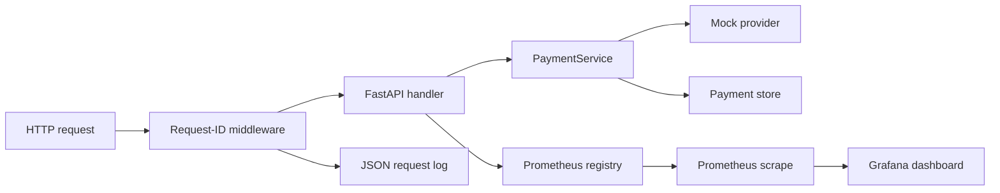

# PySwitch observability

The application owns a per-process Prometheus registry and exposes it at `/metrics`. Labels are limited to provider names, terminal statuses, bounded error categories, and circuit-state enum values. Merchant IDs, payment IDs, idempotency keys, and tokens are not metric labels.

Request logs contain event, request ID, method, path, status, latency, and safe merchant/payment identifiers when available. The middleware never logs request bodies or headers, so synthetic tokens and idempotency keys are excluded by construction. A real deployment should still route logs through its normal retention and access controls.

The provisioned dashboard covers payment status rate, provider latency p95, circuit state, and rate-limit rejections. Panels are configuration only; this repository contains no collected dashboard or load-test result.

## Local stack boundary

`docker-compose.yml` provisions FastAPI, PostgreSQL, Redis, Redpanda, Prometheus, and Grafana with container healthchecks. Prometheus waits for the app healthcheck and Grafana waits for Prometheus. The current app still uses its in-memory repository, in-memory Redis seams, and in-memory broker by default; Compose healthchecks prove container readiness, not application use of those external services.

