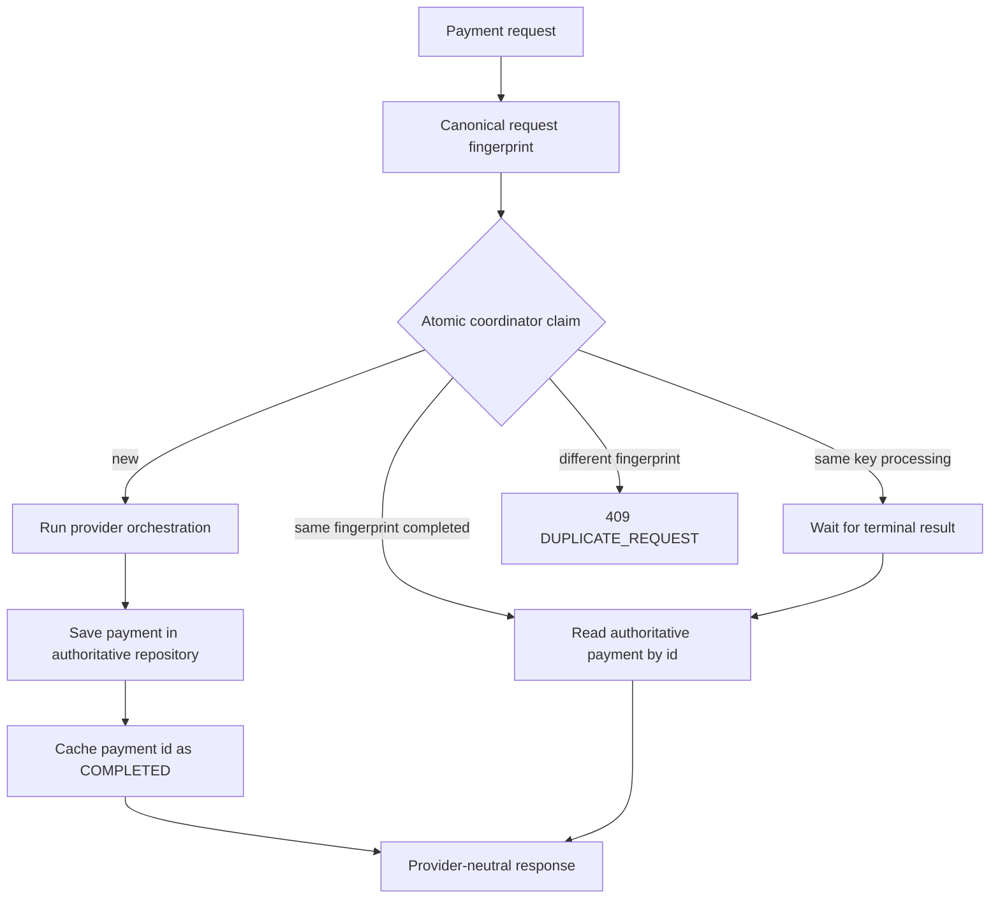
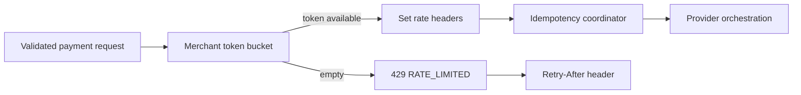

# Redis coordination and rate controls

PySwitch has optional async Redis implementations for idempotency and merchant token buckets. The default app still uses process-local implementations so a clean checkout runs without Redis. Install `.[redis]` and inject the Redis implementations during application wiring when a reachable Redis service is available.

## Idempotency flow

The Redis coordinator uses one Lua claim script. A new key stores `PROCESSING` plus its fingerprint and a bounded expiry. A matching completed key returns the cached payment ID. A matching processing key is polled until it becomes terminal or its claim expires. A different fingerprint is rejected. The payment ID is only a coordination result; the repository remains authoritative for the payment record.

The current process-local coordinator provides the same claim/wait/conflict shape for tests and local runs. It does not make a cross-process guarantee. Redis connection or command errors fail closed with HTTP 503 so a request cannot silently invoke a provider without coordination.

## Rate-limit flow

Each merchant has a bucket with configurable capacity and refill rate. The in-memory implementation serializes bucket updates with one async lock. The Redis implementation executes refill, consume, expiry, and retry calculation in one Lua script using Redis server time. Rate-limit responses include `X-RateLimit-Limit`, `X-RateLimit-Remaining`, and `Retry-After` when blocked. Redis rate-limit errors fail closed with HTTP 503.

## Actual-observed implementation notes

The following points are verified by code and tests in this repository. They are not production or load-test claims:

- `tests/test_idempotency.py::test_service_concurrent_same_key_calls_provider_once` verifies one provider call for 25 concurrent same-key service requests using the in-memory coordinator.
- `tests/test_redis_controls.py` verifies Redis coordinator claim/completion/conflict result handling with a fake command surface and verifies dependency errors become explicit unavailable exceptions.
- `tests/test_rate_limit.py::test_api_returns_rate_headers_and_429_without_provider_call` verifies the API returns 429 and rate headers before provider orchestration for a blocked merchant.
- The application factory defaults to process-local coordination; Redis-backed behavior requires explicit dependency injection and has not been tested against a live Redis server in this slice.

