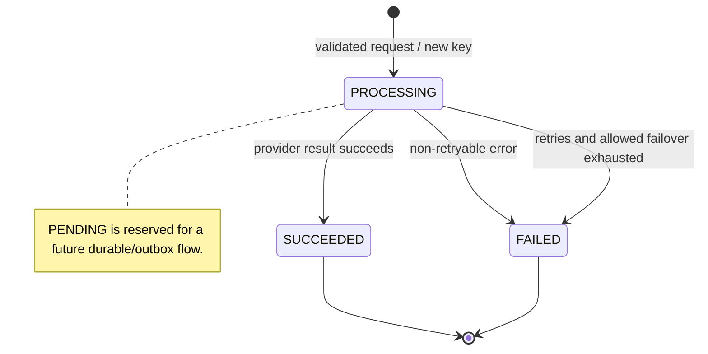
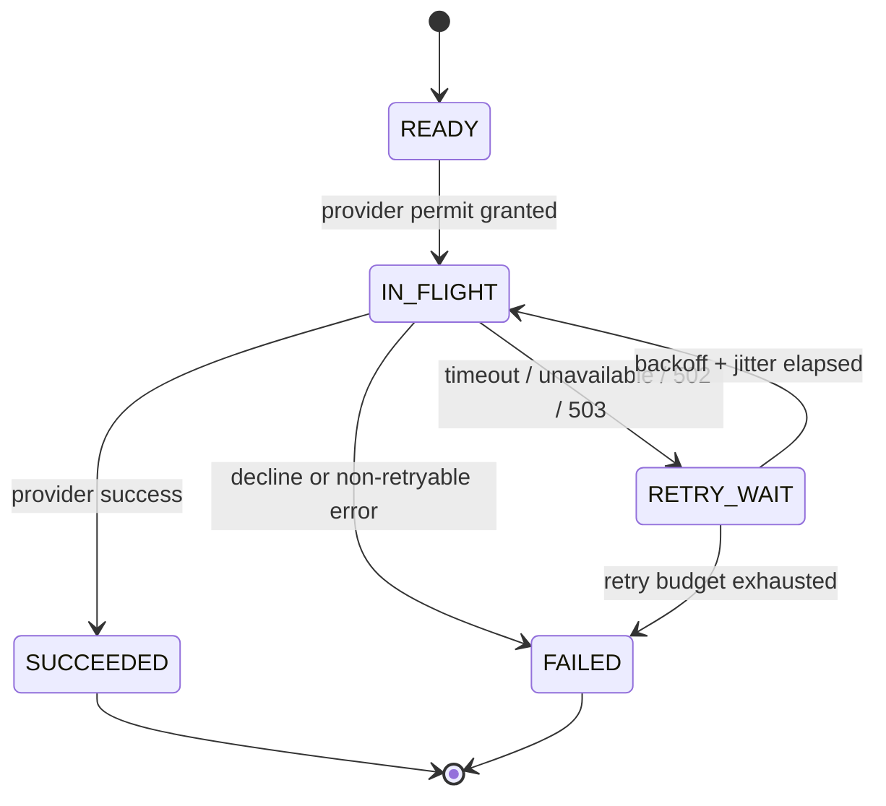
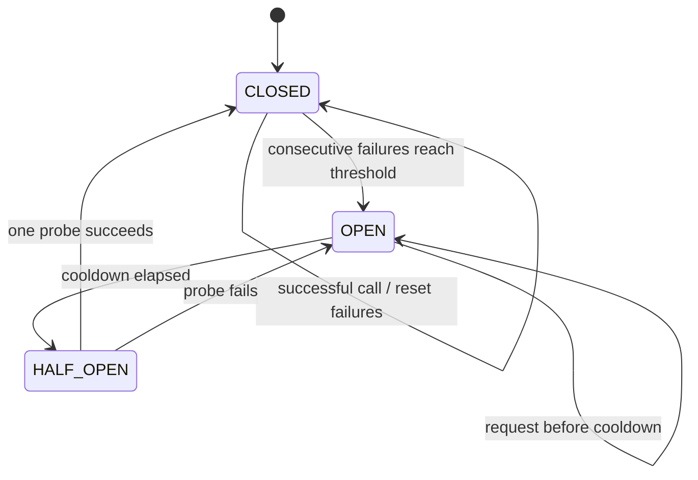
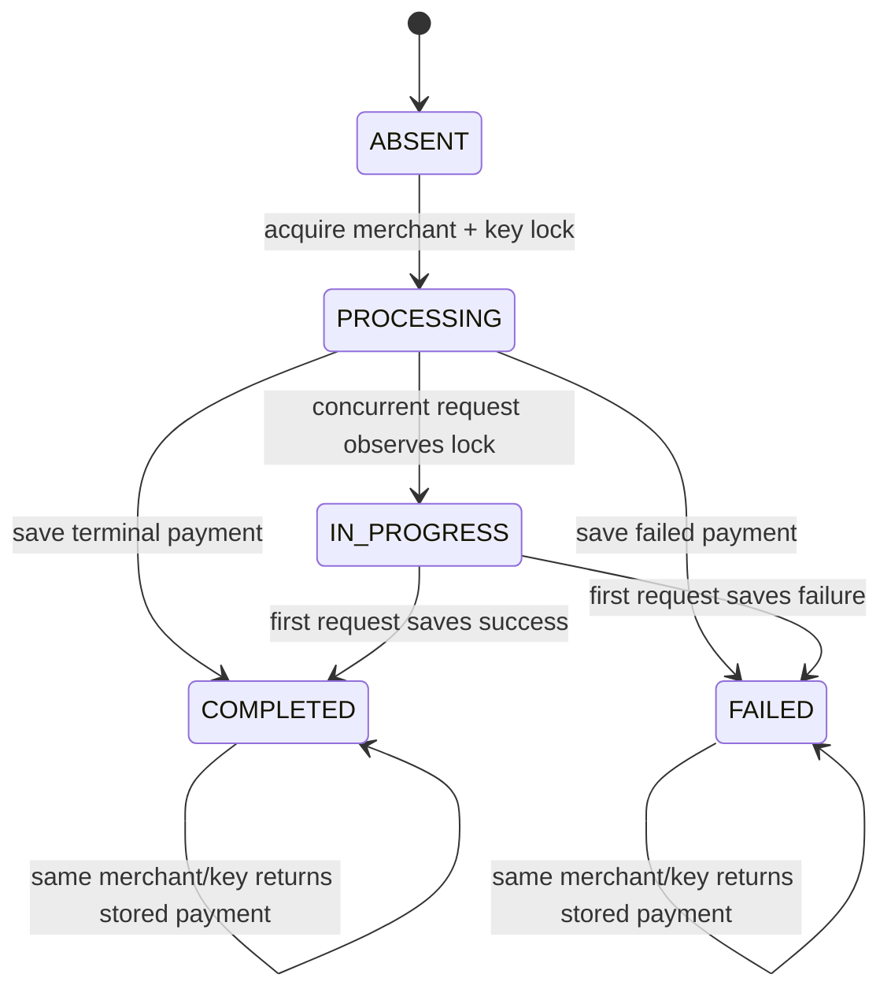

# PySwitch state machines

The diagrams describe the reliability slice and call out the parts that are still process-local. A state transition is only considered complete after the payment is saved by the current store.

## Payment lifecycle

The public response contains the payment identifier, amount, currency, merchant, status, creation time, and request identifier. It deliberately does not expose which provider handled the request. The domain enum also defines `PENDING`; the current service starts a new in-memory payment in `PROCESSING` and writes the terminal state after orchestration.

## Retry lifecycle

The default policy allows three calls per provider. Base delays are bounded at 100ms, 200ms, and 400ms, with 20% jitter. Declines do not enter `RETRY_WAIT`. An ambiguous timeout may be retried on the same provider, but it does not trigger blind cross-provider charging after the original-provider retry budget ends.

## Provider circuit lifecycle

Each provider has its own circuit instance. `OPEN` rejects new work until cooldown; `HALF_OPEN` permits one probe. The service protects permit and transition updates with a provider-specific async lock. The default threshold is three consecutive failures and the default cooldown is 30 seconds. The admin recover endpoint resets the selected provider circuit after restoring the simulation.

## Idempotency lifecycle

The current implementation realizes this lifecycle with an in-process per-merchant/key `asyncio.Lock` and an in-memory key index. It prevents duplicate provider execution among concurrent requests handled by one process. The planned durable lifecycle adds an atomic Redis `PROCESSING` claim, a cached terminal response, key expiry, a request fingerprint, and a PostgreSQL uniqueness constraint before multi-process guarantees are claimed.

## Operational interpretation

| State | Safe operator interpretation |
| --- | --- |
| `PROCESSING` | The request is in orchestration; inspect logs and attempt history before assuming a provider was charged. |
| `SUCCEEDED` | The simulator returned success and the terminal payment was saved. |
| `FAILED` | The simulator returned a non-retryable result or all permitted transient paths were exhausted. |
| Circuit `OPEN` | That provider is intentionally excluded until cooldown or admin recovery. |
| Idempotency `COMPLETED`/`FAILED` | Reusing the same merchant/key returns the stored payment in the current process. |
